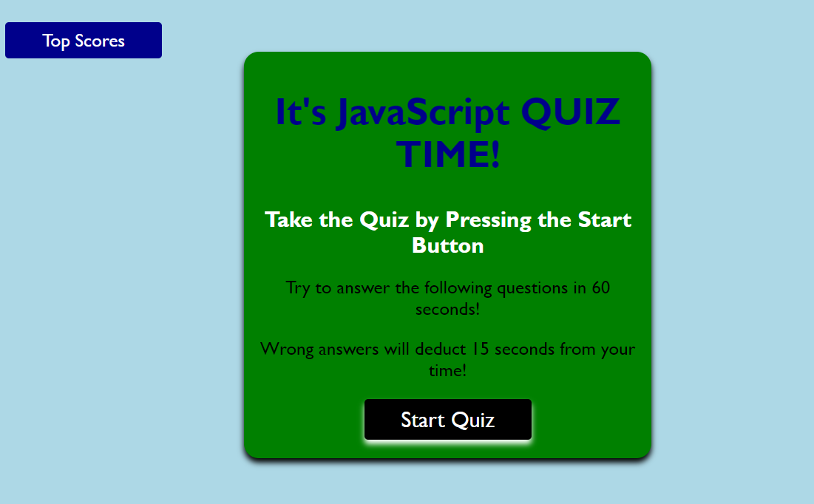
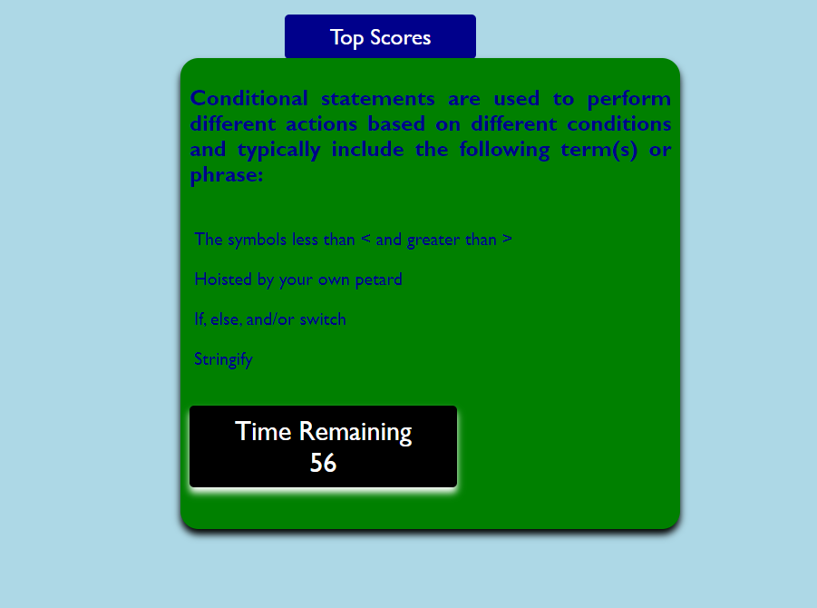
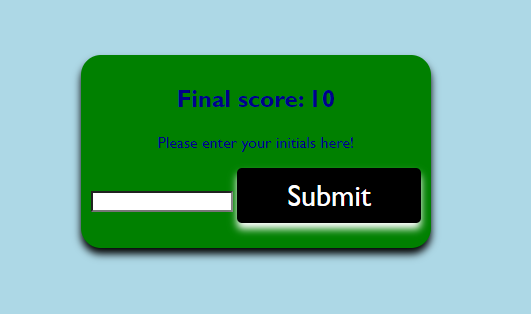
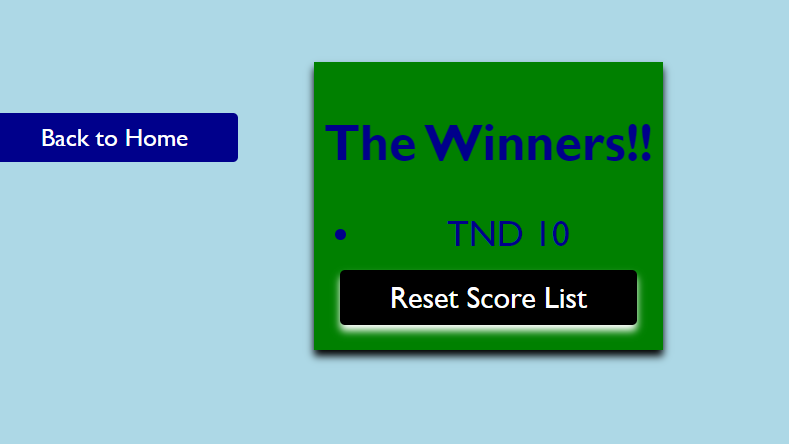

# Timed-JS-Quiz

## Technology Used 

| Technology Used         | Resource URL           | 
| ------------- |:-------------:| 
| JavaScript | [https://www.w3schools.com/jsref/event_onclick.asp](https://www.w3schools.com/jsref/event_onclick.asp);  [https://www.w3schools.com/jsref/dom_obj_pushbutton.asp](https://www.w3schools.com/jsref/dom_obj_pushbutton.asp); [https://www.w3schools.com/jsref/prop_style_position.asp](https://www.w3schools.com/jsref/prop_style_position.asp); [https://developer.mozilla.org/en-US/docs/Web/JavaScript/Reference/Global_Objects/Array](https://developer.mozilla.org/en-US/docs/Web/JavaScript/Reference/Global_Objects/Array);[https://www.w3schools.com/jsref/prop_win_localstorage.asp](https://www.w3schools.com/jsref/prop_win_localstorage.asp);[https://www.w3schools.com/js/tryit.asp?filename=tryjson_store](https://www.w3schools.com/js/tryit.asp?filename=tryjson_store); 


## Description 

This application is a JavaScript Quiz. 

The landing page has both a "Start Quiz" button and a button to see "Top Scores".



Once the quiz starts, a countdown timer also begins.

For every wrong answer, an additional 15 seconds is removed from the timer.



When the quiz is over, if you have a score greater than zero, you are asked to enter your initals to be included on a top score page.



You are then directed to the top score page where you can see your scores!

From this page you can reset the top score list if you wish and also return to the home page.




[Visit the Deployed Site](https://tdusenbury.github.io/Timed-JS-Quiz/)


## Code Example
***UPDATE:
I was able to take the advice from the initial grader, review the lessons, and work with members of my cohort to unravel the quiz and complete the requirements.

Below are the pictures from the first submission.
-----------------
***ORIGINAL:
I had a lot of issues with this code initially I finally was able to populate all the fields separately, but I did a total git failure and didn't push up. 

I was unable to get back to where I was and each section now overlaps one or the other.


-------------------------------------------------


## Usage 

When up and running, this would be a great tool for creating study questions for review as they were studying each night. You could create one for each applicable class. With more skills, the questions could be randomized to ensure greatest challenge.


## Learning Points 
***UPDATE: I worked on the code to correct the issues.

-----------------------------------------------------
This was another project that utilized JavaScript. I learned from my last project to approach each part section by section. I did start off really well and was remembering to git commit regularly.  I created an array that initially loaded to my quiz screen and rotated throught the questions. I then added the high score page and tried to complete the hidden/visible styles on each section. Somewhere in there I both forgot to git commit and I tried to do too many things at once and lost control.

Frankly, I thought I had it because I did understand how to create each part, but I got cocky and forgot to follow best practices.

At the same time, I have to remind myself that just over two weeks ago I had zero experience with this kind of work. This application may not actually do everything that it is supposed to, but what I did create is not far from being useful. 

I look forward to learning more and then coming back to this when the cohort is over and debugging and refactoring my work.

I am also learning that I really enjoy the styling aspect of this work.

PS This will forever be the project I was working on when my son completed his Eagle Project. 

## Author Info


TAMARA "T" DUSENBURY
```
    I am excited to take my knowledge of various industries into the virtual realm.

* [Portfolio](https://youtu.be/bHX54GCrDB4)
* [LinkedIn](https://www.linkedin.com/in/tamara-dusenbury-02ab8591/)
* [Github](https://github.com/tdusenbury)
```
```


## Credits

Shout out to Laurie and Tia for being moral support and extra eyes!!
Extra huge thank you's to Liubov for the patience to help me untangle my functions!!!


## License

MIT License

Copyright (c) 2023 tdusenbury

Permission is hereby granted, free of charge, to any person obtaining a copy
of this software and associated documentation files (the "Software"), to deal
in the Software without restriction, including without limitation the rights
to use, copy, modify, merge, publish, distribute, sublicense, and/or sell
copies of the Software, and to permit persons to whom the Software is
furnished to do so, subject to the following conditions:

The above copyright notice and this permission notice shall be included in all
copies or substantial portions of the Software.

THE SOFTWARE IS PROVIDED "AS IS", WITHOUT WARRANTY OF ANY KIND, EXPRESS OR
IMPLIED, INCLUDING BUT NOT LIMITED TO THE WARRANTIES OF MERCHANTABILITY,
FITNESS FOR A PARTICULAR PURPOSE AND NONINFRINGEMENT. IN NO EVENT SHALL THE
AUTHORS OR COPYRIGHT HOLDERS BE LIABLE FOR ANY CLAIM, DAMAGES OR OTHER
LIABILITY, WHETHER IN AN ACTION OF CONTRACT, TORT OR OTHERWISE, ARISING FROM,
OUT OF OR IN CONNECTION WITH THE SOFTWARE OR THE USE OR OTHER DEALINGS IN THE
SOFTWARE.
